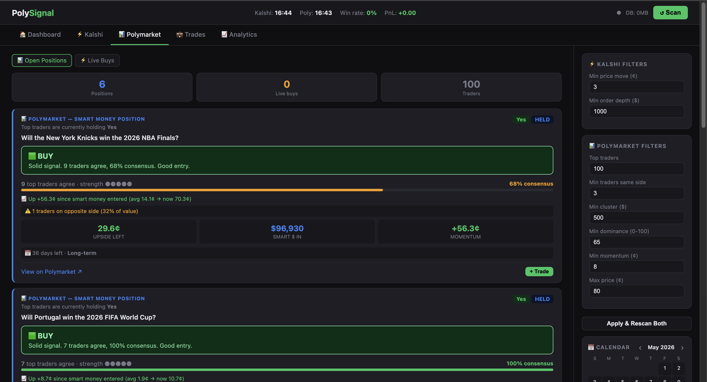

# PolySignal

A real-time behavioral analytics platform monitoring 200+ prediction markets across [Kalshi](https://kalshi.com) and [Polymarket](https://polymarket.com). Detects order flow shifts, smart money consensus patterns, and liquidity changes to surface actionable signals across economics, Fed policy, crypto, sports, and politics markets.

**Live:** [polysignal-production-0227.up.railway.app](https://polysignal-production-0227.up.railway.app)



---

## What it does

Prediction markets price the probability of real-world events. Large, informed traders move these prices before information becomes public. PolySignal monitors this activity in real time across two platforms:

- **Kalshi** — detects anonymous large orders moving market prices (order flow signals)
- **Polymarket** — tracks the top 100 ranked traders by PnL and surfaces markets where multiple smart money accounts converge on the same side (consensus signals)

When both platforms agree on the same market, the signal confidence is significantly higher.

---

## Features

- **Real-time order flow detection** — scans 200+ Kalshi markets every 60 seconds for significant price moves with minimum order depth thresholds
- **Smart money consensus tracking** — monitors top 100 Polymarket traders by monthly PnL, detects when 3+ independent accounts hold the same position
- **Cluster detection** — alerts when 2+ large orders hit the same Kalshi market in the same direction within a 4-hour window
- **Signal outcome tracking** — automatically marks signals WON/LOST when markets resolve, building a historical accuracy dataset
- **Telegram alerts** — real-time notifications with action recommendations (STRONG BUY / BUY / WATCH / STAY OUT), timing context (short vs long-term), and momentum data
- **Morning brief** — daily 8am summary of top active positions and upcoming economic releases
- **FRED economic calendar** — integrates Federal Reserve release dates for CPI, GDP, NFP, PCE, PPI, and retail sales
- **Trade logging** — manual trade entry with unrealized PnL tracking and strategy tagging
- **Analytics dashboard** — signal accuracy by platform, PnL tracking, signals per day chart, and performance by strategy

---

## Tech Stack

| Layer | Technology |
|---|---|
| Backend | Python 3, Flask |
| Database | PostgreSQL (Railway) / SQLite (local) |
| ORM | SQLAlchemy |
| Scheduling | Python threading |
| Deployment | Railway (24/7) |
| Alerts | Telegram Bot API |
| Data Sources | Kalshi API, Polymarket Data API, FRED API |
| Frontend | Vanilla JS, Chart.js |

---

## Architecture

```
polysignal/
├── polysignal.py      # Flask app, routes, scan runners, scheduler
├── database.py        # SQLAlchemy models, DB helpers
├── kalshi.py          # Kalshi API, orderbook analysis, accumulator
├── polymarket.py      # Leaderboard fetching, consensus detection
├── signals.py         # Alert logic, outcome tracking, FRED calendar
├── telegram_bot.py    # Telegram formatting and polling
├── requirements.txt
└── Procfile
```

**Background threads (always running):**
- Kalshi scan — every 60 seconds
- Polymarket positions — every 5 minutes
- Polymarket live buys — every 90 seconds
- Trade price updater — after each Kalshi scan
- Signal outcome checker — after each Kalshi scan
- DB cleanup (snapshots > 7 days) — after each Kalshi scan

---

## Signal Logic

### Kalshi — Order Flow
Triggers when YES price moves ≥3¢ with order depth ≥$1,000 in a single scan cycle. Anonymous — you're following money movement, not a specific trader.

**Cluster alert:** fires when 2+ qualifying moves hit the same market in the same direction within 4 hours and combined depth exceeds $2,000.

### Polymarket — Smart Money Consensus
Pulls the top 100 traders by monthly PnL. For each market, calculates:
- How many independent top traders hold the same side
- Rank-weighted dominance score
- Momentum (current price vs weighted avg entry)

Signals require: ≥3 traders, ≥65% dominance, ≥8¢ momentum, current price ≤80¢.

### Action Recommendations
Every signal card shows a clear recommended action:

| Label | Meaning |
|---|---|
| 🟢 STRONG BUY ✦ | High confidence — multiple strong criteria met |
| 🟩 BUY | Solid signal, good entry |
| 🟡 QUICK ENTRY ⚡ | Short-term play, act fast |
| 🟠 WATCH 👀 | Signal present but not all criteria ideal |
| 🔴 STAY OUT | Large sell — money flowing out |
| ⚫ TOO LATE | Upside already captured |

---

## Setup (Local)

```bash
git clone https://github.com/AmadeoSV/polysignal.git
cd polysignal
pip install -r requirements.txt

TELEGRAM_BOT_TOKEN=your_token \
TELEGRAM_CHAT_ID=your_chat_id \
FRED_API_KEY=your_fred_key \
python3 polysignal.py
```

Open `http://localhost:5050`

**Get API keys:**
- FRED: [fred.stlouisfed.org/docs/api/api_key.html](https://fred.stlouisfed.org/docs/api/api_key.html) (free)
- Telegram: Create a bot via [@BotFather](https://t.me/botfather) (free)
- Kalshi and Polymarket APIs are public and require no key

---

## Deployment (Railway)

1. Fork this repo
2. Create a Railway project with a PostgreSQL database
3. Connect your GitHub repo to Railway
4. Set environment variables: `TELEGRAM_BOT_TOKEN`, `TELEGRAM_CHAT_ID`, `FRED_API_KEY`, `DATABASE_URL`
5. Deploy — Railway auto-detects the Procfile and runs gunicorn

The app switches automatically between SQLite (local) and PostgreSQL (production) based on the `DATABASE_URL` environment variable.

---

## Data Collected

The platform continuously logs:
- **Signals** — platform, market, direction, price move, depth, timestamp, outcome (WON/LOST)
- **Market snapshots** — Kalshi price and depth every 60 seconds (auto-cleaned after 7 days)
- **Trades** — manual entries with entry/exit price, PnL, strategy tag
- **Economic events** — upcoming FRED release dates

Signal outcome data accumulates over time to build a historical accuracy dataset for each signal type, enabling future classification and confidence scoring.

---

## Status

Actively developed. Currently in data collection phase — accumulating signal outcomes to train signal classification and confidence scoring.

**Roadmap:**
- [ ] Signal archetype classification (conviction vs scalp vs noise)
- [ ] Price-after tracking (5m, 15m, 1h, 24h post-signal)
- [ ] Cross-platform arbitrage detection
- [ ] Confidence scoring model trained on collected outcomes

---

## License

MIT
