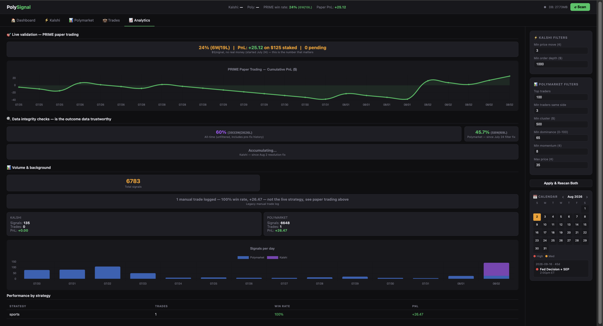
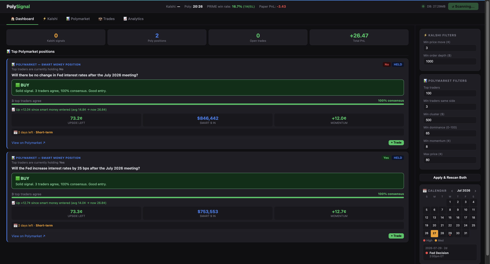
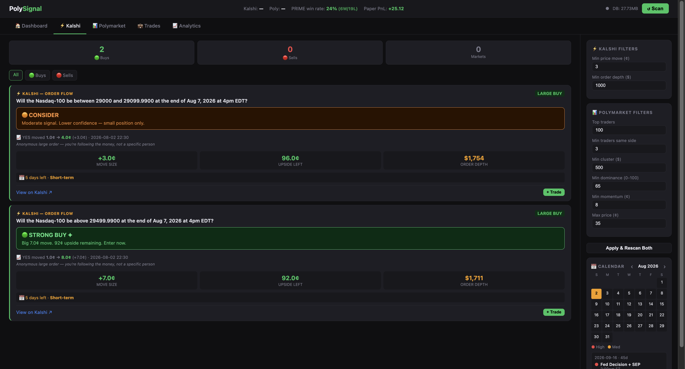

# PolySignal

A real-time behavioral analytics platform monitoring 300+ prediction markets across [Kalshi](https://kalshi.com) and [Polymarket](https://polymarket.com). Detects smart money consensus patterns and surfaces signals with a statistically verified, audited edge — not just a raw activity feed.

**Live:** [polysignal-production-0227.up.railway.app](https://polysignal-production-0227.up.railway.app)



---

## What it does

Prediction markets price the probability of real-world events. PolySignal monitors top-ranked Polymarket traders in real time, detects when multiple independent accounts converge on the same position, and cross-references that against a corrected, audited outcome dataset to identify where the market is genuinely mispriced — rather than assuming consensus itself is predictive.

The project's most important finding came from questioning its own results: an initial backtest suggested a large, sweeping edge across cheap contracts. Digging into *why* it was that large surfaced a data-integrity bug affecting over half of all historical outcome labels. Fixing it and re-running the analysis produced a smaller, real, and independently verified edge — concentrated specifically in fresh, sub-35¢ signals, with pricing above roughly 50¢ turning out to be close to efficient rather than broadly mispriced as first believed.

---

## Key Finding: Auditing Your Own Backtest

Early analysis of 6,350+ resolved signals suggested cheap (≤35¢) contracts carried a ~20¢+ per-contract edge, while expensive (80¢+) contracts lost ~50¢ per contract — a dramatic reverse favorite-longshot bias.

That number turned out to be substantially inflated by a resolution bug: the outcome-checker compared a signal's result against a generic market price rather than the *specific* side it was on, silently flipping WON/LOST for roughly half of two-sided markets. A standalone audit tool (`audit_outcomes.py`) was built to re-verify every historical signal against ground-truth settlement data pulled directly from Polymarket's CLOB API, matching on the named outcome rather than a price threshold.

**Result:** 3,369 of 6,386 signals (53%) had the wrong label. After correcting the data and re-running the analysis:

| Price range | Edge (pre-audit) | Edge (corrected, deduplicated) |
|---|---|---|
| ≤35¢ | +24.0¢ | **+7.0¢** (391 distinct markets) |
| 36–50¢ | +6.3¢ | +2.4¢ (thin, near noise) |
| 51–65¢ | -3.2¢ | -3.4¢ |
| 66–80¢ | -20.4¢ | -2.8¢ |
| 80¢+ | -48.7¢ | -1.0¢ |

The market is far more efficient than the initial backtest suggested. A real, statistically defensible edge (32% win rate vs. a 25% breakeven implied by price) survives specifically in sub-35¢ signals — everything above ~50¢ is close to fairly priced, not badly mispriced.

A later pass, splitting this same ≤35¢ population further by freshness (signals caught before vs. after meaningful price drift), found the edge concentrates even more specifically in the fresh tier: **+16.1¢/contract** for signals with <2¢ drift since detection, versus **-2.1¢** for signals where price had already moved — run on a larger, further-accumulated dataset than the 391-market table above, not a strict subset of it. Production alerting now uses this freshness split (see [Signal Logic](#signal-logic) below), since it's the more specific and more recent of the two findings.

Both the resolution bug and the audit fix are live in production. `poly_max_price` and alerting are tuned to the corrected finding, not the original inflated one.

---

## Live Validation: Paper Trading

Rather than trust the corrected backtest alone, every signal that clears the validated filter (fresh, ≤35¢) is logged as a hypothetical $5 position — no real capital — and automatically resolved against the same audited outcome pipeline. This builds a genuine forward track record on top of the historical analysis, visible on the dashboard as a live cumulative PnL chart (see the analytics screenshot above), including the deduplicated Kalshi accuracy tile — labeled explicitly as distinct-market data, not raw signal rows, after finding raw counts overstate real outcomes by roughly 18x.

---

## Kalshi: The Same Audit Discipline, Applied a Second Time

Kalshi order-flow detection had been running for two months and had produced essentially nothing — 21 signals total, against 6,500+ from Polymarket over the same window. That gap was suspicious enough to investigate directly rather than assume Kalshi's markets were just quiet.

**The cause:** `detect_move()` decides whether a price counts as a real move by comparing it to the previous scan's price for that market. That previous-price memory was being rebuilt empty at the start of every single scan, instead of persisting between them — so the comparison always had nothing to compare against, and the function could never fire. Not a tuning problem; a structural one, present since the scanner was first split into its own service.

Fixed by moving that memory to persist across scans instead of resetting each time. Kalshi began detecting real signals within minutes of deploying the fix.

**A second bug, found while checking whether the fix could be trusted:** before treating any of Kalshi's new signal volume as reliable, its outcome-resolution logic got the same scrutiny that had already caught a major bug on the Polymarket side. It turned out to have the *exact same* flaw — a price crossing 95¢ or 5¢ was being treated as proof a market had closed, with no check on whether it actually had. A code comment nearby claimed Kalshi was "unaffected" by this failure mode; it wasn't. Kalshi's own watchlist includes live, in-progress sports markets that can spike on a single dramatic moment the same way a live tennis match did on Polymarket. Fixed to check Kalshi's actual settlement `result` field instead of inferring it from price — confirmed against Kalshi's live API before shipping. All previously-resolved Kalshi outcomes (a small number, since the platform had barely been producing any) were reset and left to re-resolve correctly.

**Where this leaves Kalshi:** detection and resolution are now trustworthy, and every signal above a small noise floor (0.5¢ move, $100 depth — see [Signal Logic](#signal-logic) for how this differs from the alert threshold) is being saved for research — the same "collect broadly, find the edge empirically" approach that worked for Polymarket, rather than guessing at per-market thresholds up front. No price-bucket edge analysis has been run on Kalshi data yet, and Kalshi's market structure (regulated, USD-denominated, no trader-consensus mechanism, a different mix of macro vs. sports markets) means the Polymarket findings above don't necessarily carry over. That's an open question, not an assumption either way.

### Round Two: Category Data, a Rate-Limit Storm, and a Silent Detection Gap

Getting Kalshi detecting and resolving correctly wasn't the end of it. A second pass, prompted by wanting to slice Kalshi's data by market type, found four more real bugs — three of them only visible once real volume hit the pipeline.

**Category was blank on every signal, on both platforms.** Kalshi's `/markets` endpoint no longer returns a `category` field at all (confirmed against Kalshi's current API docs — it was removed from Market responses; the real field lives one level up, on the Series object). Polymarket never had a category field to begin with. Fixed both: Kalshi now looks up each series's real category via `GET /series/{ticker}` (cached per series), and Polymarket pulls each event's real tags via the Gamma API — verified against live API responses before shipping, since a first guess at Kalshi's category taxonomy (built from ticker-prefix patterns) turned out not to match Kalshi's actual category names once checked against the real endpoint. Backfilled ~6,700 existing blank rows on each platform once the fix was live.

**A rate-limiting storm, self-inflicted.** The resolution-check loop tried every pending signal, every single cycle — harmless at low volume, but once the backlog passed a few thousand, that was thousands of Kalshi API calls fired back-to-back every cycle. A second loop (per-market orderbook fetching) had zero pacing between calls at all. Together, both were tripping real 429 rate limits from Kalshi hard enough that almost nothing was resolving — confirmed directly in the logs, where a retry-loop bug was also mislabeling every rate-limited failure as a generic `None` error instead of what it actually was. Fixed with a bounded per-cycle batch, real exponential backoff, and proper request pacing.

**The first fix for that made it worse, in a different way.** Bounding the batch by *oldest signal first* seemed like the obvious way to drain a backlog fairly. It backfired: "oldest" doesn't change for a signal that hasn't resolved yet, so the same fixed set of long-dated economics/politics signals got re-selected and re-checked every cycle, forever — while the much larger pool of fast-resolving sports and commodities signals never got touched at all. Confirmed live: zero net resolutions for over an hour even after the rate-limit fix deployed. Switched to random selection each cycle instead, so every pending signal gets a fair, eventually-covers-everything chance.

**A second, unrelated gap surfaced during that same investigation.** The resolution loop only ever considered signals detected within the last 60 days — reasonable-looking, but silently permanent: a signal that ages past that window is excluded forever, even if it later resolves with a perfectly good result sitting on Kalshi's API. Confirmed directly on a real example (a May CPI market, finalized with `result: "no"`, invisible to the resolver at 72 days old). Extended the window to 400 days.

**The last bug, found on a final audit pass, not a live symptom.** `fetch_markets()` requested only the first 20 open markets per series, per cycle, with no pagination — confirmed against Kalshi's own docs that `/markets` is cursor-paginated and a single call only returns page one. On any day with a full slate (a normal MLB day is ~15 games × 2 tickers), markets past position 20 were silently invisible to the scanner from the moment they opened, not just slow to resolve — confirmed concretely: a real, finalized MLB game had zero rows in the signals table, ever. Fixed with real cursor-following pagination, plus a per-series sub-cap so one busy sports day can't now crowd out every other category the same way sports itself was originally crowded out (see above).

**Where this actually leaves things:** as of this pass, Kalshi's deduplicated resolved sample sits at 35W/35L (578 still pending, drawn from a research-capture pool of ~8,400 signals) — a real, live, steadily-growing number now that the pipeline is fixed end to end, not yet a large enough sample to say anything about an edge. The pattern across both audit passes is the same one that shaped the Polymarket findings above: assume nothing is silently correct just because it isn't throwing an error, and check every fix against live data before trusting it.

---

## Features

- **Real-time consensus tracking** — monitors top 100 Polymarket traders by monthly PnL, detects when 3+ independent accounts converge on the same position
- **Audited outcome resolution** — signals resolve only once a market's actual `closed` status is confirmed via Polymarket's CLOB API, matched against the specific named outcome (not a generic price threshold)
- **Freshness-gated alerting** — only signals caught before significant price drift (<2¢ moved) trigger a Telegram alert; the confirmed-weaker tier is tracked but not surfaced
- **Paper trading** — every alerted signal is logged as a $5 hypothetical position and auto-resolved, building a live, real-money-free performance record
- **Standalone audit tooling** — `audit_outcomes.py` independently re-verifies historical outcome data against ground truth, catching systemic labeling defects after the fact
- **Kalshi order flow detection** — scans 300+ Kalshi markets every 60 seconds for significant price moves with minimum order depth thresholds
- **Telegram alerts** — real-time PRIME-tier notifications with entry price, momentum, consensus %, and live/upcoming resolution context
- **Morning brief** — daily summary of active signals, paper trading performance, and upcoming Fed/economic releases
- **Analytics dashboard** — all-time and post-fix signal accuracy, paper trading cumulative PnL, signal volume by day


*A live PRIME signal: consensus %, momentum since entry, and upside remaining, surfaced the moment 3+ top traders converge on the same side.*


*Kalshi order-flow detection, live: a Nasdaq-100 index contract flagged STRONG BUY off a large, fast move with real order depth behind it.*

---

## Tech Stack

| Layer | Technology |
|---|---|
| Backend | Python 3, Flask |
| Database | PostgreSQL (Railway) / SQLite (local) |
| ORM | SQLAlchemy |
| Deployment | Railway, two services (24/7) |
| Alerts | Telegram Bot API |
| Data Sources | Kalshi API, Polymarket Data API, Polymarket CLOB API, Polymarket Gamma API, FRED API |
| Frontend | Vanilla JS, Chart.js |

---

## Architecture

Deployed as **two independent Railway services** sharing one PostgreSQL database:

```
polysignal/
├── worker.py           # Standalone scanner — runs all scans, alerting,
│                        # outcome resolution, and paper trading 24/7.
│                        # This is the live process; polysignal.py has
│                        # no scanning logic of its own.
├── polysignal.py        # Flask dashboard — reads from the shared DB,
│                        # serves the web UI. No scanner.
├── database.py          # SQLAlchemy models, DB helpers, paper trading
├── kalshi.py             # Kalshi API, orderbook analysis, accumulator
├── polymarket.py         # Leaderboard fetching, consensus detection,
│                        # CLOB/Gamma price + resolution lookups
├── signals.py            # Alert logic, audited outcome resolution,
│                        # FRED calendar, price-after tracking
├── telegram_bot.py       # Telegram formatting and polling
├── audit_outcomes.py     # Standalone tool: re-verifies historical
│                        # outcomes against Polymarket ground truth
├── requirements.txt
└── Procfile
```

**worker.py background loop (always running):**
- Kalshi scan — every 60 seconds
- Polymarket positions — every 5 minutes
- Polymarket live buys — every 90 seconds
- Signal outcome resolution (CLOB-verified, named-outcome matched) — after each scan
- Paper trade resolution — after each outcome check
- Signal/trader price-history tracking (15m/1h/4h/24h/7d buckets) — hourly
- DB cleanup (snapshots, 2-day retention) — after each scan

---

## Signal Logic

### Polymarket — Smart Money Consensus
Pulls the top 100 traders by monthly PnL. For each market: trader count, rank-weighted dominance, momentum (current price vs. weighted avg entry).

**Signal creation requires:** ≥3 traders, ≥65% dominance, current price ≤35¢ (tightened from an original 80¢ cap after the corrected edge analysis showed no defensible edge above ~50¢).

**Alerting additionally requires freshness:** price moved <2¢ since the tracked entry. This is the tier with the confirmed, audited edge (+16.1¢/contract on corrected data); the "moved" tier is tracked internally but no longer alerted on, since it showed no meaningful edge after correction.

### Outcome Resolution
A signal resolves WON/LOST only when Polymarket's own `closed` flag confirms the market has actually settled — checked via CLOB, with Gamma as fallback — matched against the specific outcome name the signal was on. Price alone is never used as a resolution proxy; an earlier version of this logic did use a price threshold and was the source of the 53% mislabeling bug described above.

### Kalshi — Order Flow
**Research collection:** every real price tick above a small noise floor — ≥0.5¢ move, ≥$100 depth — gets saved to the database, regardless of whether it's alert-worthy. Same "collect broadly, find the edge empirically" approach used for Polymarket, rather than guessing at per-market thresholds up front.

**Alerting:** surfaces only moves ≥3¢ with depth ≥$1,000 in a single scan cycle. These are the original, untuned production thresholds — kept as-is deliberately while enough data accumulates under the broader collection floor to eventually tighten them with evidence, the same way Polymarket's price cap was tightened from 80¢ to 35¢ once the edge analysis actually supported it.

---

## Setup (Local)

```bash
git clone https://github.com/AmadeoSV/polysignal.git
cd polysignal
pip install -r requirements.txt

TELEGRAM_BOT_TOKEN=your_token \
TELEGRAM_CHAT_ID=your_chat_id \
FRED_API_KEY=your_fred_key \
python3 worker.py
```

Run `polysignal.py` separately (or via Flask/gunicorn) to serve the dashboard against the same `DATABASE_URL`.

**Get API keys:**
- FRED: [fred.stlouisfed.org/docs/api/api_key.html](https://fred.stlouisfed.org/docs/api/api_key.html) (free)
- Telegram: Create a bot via [@BotFather](https://t.me/botfather) (free)
- Kalshi and Polymarket APIs are public and require no key

---

## Deployment (Railway)

Deployed as two separate Railway services against one shared PostgreSQL database:

1. Fork this repo
2. Create a Railway project with a PostgreSQL database
3. Add **two services** from the same repo:
   - `polysignal-worker` — start command `python3 worker.py` (all scanning, alerting, resolution)
   - `polysignal` — start command per `Procfile` (`gunicorn`), dashboard only
4. Set environment variables on both services: `TELEGRAM_BOT_TOKEN`, `TELEGRAM_CHAT_ID`, `FRED_API_KEY`, `DATABASE_URL`
5. Deploy both

---

## Data Collected

- **Signals** — platform, market, direction, price at detection, momentum, dominance, timestamp, audited outcome (WON/LOST)
- **Paper trades** — hypothetical $5 positions on every alerted (PRIME) signal, auto-resolved against the same audited pipeline
- **Signal/trader price history** — price at 15m/1h/4h/24h/7d after signal detection, for repricing and trader-accuracy research
- **Market snapshots** — Kalshi price and depth every 60 seconds (2-day retention)
- **Economic events** — upcoming FRED release dates

---

## Status

Actively developed and running in production. The core edge-finding phase is complete and independently audited; current focus is accumulating a live paper-trading sample to validate the corrected finding forward, and researching whether the edge concentrates further by time-to-resolution or by individual trader identity.

**Roadmap:**
- [ ] Time-to-resolution analysis on corrected, unbiased data (the field needed for this, `hours_to_close`, was itself found and fixed mid-project)
- [ ] Trader-identity analysis — do specific top traders predict edge independent of consensus count (already shown *not* to matter on its own)
- [ ] Repricing/drift analysis using `signal_price_history` — does price move toward fair value shortly after a fresh signal, enabling an early-exit strategy
- [x] ~~Kalshi signal volume investigation (currently near-zero over two months)~~ — diagnosed and fixed, see [Kalshi: The Same Audit Discipline, Applied a Second Time](#kalshi-the-same-audit-discipline-applied-a-second-time). Next step: accumulate enough resolved outcomes to run the same price-bucket edge analysis already done for Polymarket.

---

## License

MIT
